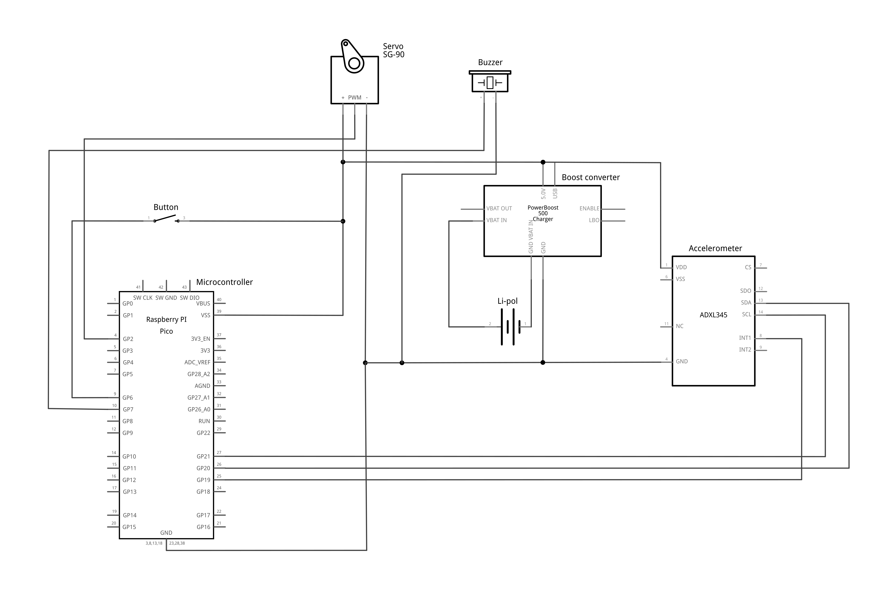

# James rocket controller
Control firmware for a rocket project built with Raspberry Pi Pico. Turn a servo when an accelerometer enters a free fall, use button for activation/restart, provide visual and audible feedback and log + retrieve/parse data in flash memory. Made for model rocket competition _Czech Rocket Challenge_.

## Operation
After flasing `rocket` binary and booting, program will wait for a button press to lock the parachute (turn servo to initial position). Then it's ready for a flight. Parachute will open right after rocket reaches its peak (turn servo when a free fall event is received from the sensor). Piezo will also be activated at that point, to make finding the rocket easier. Accelerometer data is logged periodically, along with some other events. Log can be retrieved using the `logdump` binary and parsed to CSV with `parselog` script.

## Software
Software is using the C/C++ Pi Pico SDK, which needs to be installed in a standard way. Littlefs is used for saving data to flash.

## Hardware
- Raspberry Pi Pico
- SG90 servo
- ADXL345
- Adafruit PowerBoost 500
- Li-Pol battery
- Piezo buzzer
- Button

### Fritzing diagram
